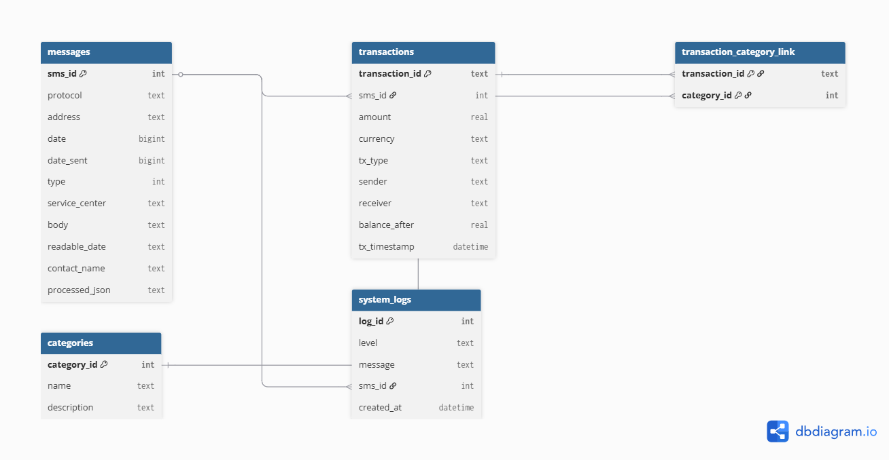

## Team Name: DEVSQUAD

## Project Description

This project is a fullstack application that takes MoMo SMS data in XML format, cleans and organizes it, then stores it in a database. The system categorizes transactions like deposits, withdrawals, and payments, making the data easier to understand. On top of that, it provides a simple dashboard interface where users can explore charts and insights to analyze their financial activity.

## Group Members
- **Aime Ndayambaje** – [@aimelive](https://github.com/aimelive)  
- **Ngororano Armstrong** – [@capitale1](https://github.com/capitale1)  

## Scrum Board

We are using a GitHub Project board to manage our tasks with Agile methodology.  
You can view our Scrum board here: [DEVSQUAD Scrum Board](https://github.com/users/aimelive/projects/2)

## Project Structure

```

├── README.md                        # Setup, overview
├── docs/                             # Documentation
├── database/
│   └── database\_setup.sql            # SQL schema + sample data
├── .env.example                      # Environment variables
├── requirements.txt                  # Python dependencies
├── index.html                         # Dashboard entry (static)
├── web/                               # Dashboard frontend (CSS, JS, assets)
├── data/
│   ├── raw/                           # Input XML
│   ├── processed/                      # Cleaned / aggregated JSON
│   ├── db.sqlite3                       # SQLite DB
│   └── logs/                            # ETL logs and dead letters
├── etl/                                 # ETL scripts (parse, clean, categorize, load)
├── api/                                 # REST API implementation
├── dsa/                                 # DSA comparison scripts
├── scripts/                             # Shell scripts to run ETL, export JSON, serve frontend
└── tests/                               # Unit tests

````

## High-Level System Architecture

Here is our system architecture diagram. Click the image to open its path:


## Database Design Overview

The database supports the processing of MoMo SMS data by separating raw messages from parsed transactions.  
Key tables include:

- **messages** – Stores every SMS exactly as received, including metadata and the full message body.  
- **transactions** – Holds structured details parsed from messages (amounts, sender/receiver, timestamps).  
- **categories** – Lookup table of transaction categories such as deposit, payment, or transfer.  
- **transaction_category_link** – Junction table to handle the many-to-many relationship between transactions and categories.  
- **system_logs** – Tracks ETL runs, errors, and processing context for transparency and troubleshooting.

This structure ensures:
- Data integrity through primary/foreign key constraints.  
- Auditability by preserving the original SMS content.  
- Scalability for future dashboard queries and analytics.



## Database Documentation
[Database Design Document](docs/Database%20Design%20Document%20(2).pdf)

---

##  REST API Setup & Usage

This part of the project exposes the MoMo SMS data through a secure REST API built with **plain Python** (`http.server`).  
It provides CRUD endpoints to view and manage transactions that were parsed from the original XML file.

### 1️. Requirements
- **Python 3.9+**
- `requirements.txt` dependencies (for XML parsing and timing measurements)
```bash
pip install -r requirements.txt
````

### 2️. Parse the XML into JSON

Before starting the API, convert the raw SMS data into a JSON dataset:

```bash
python dsa/parse_xml.py modified_sms_v2.xml data/transactions.json
```

This creates `data/transactions.json` which the API will serve.

### 3️. Run the API Server

```bash
python -m api.server
```

The API will start on:
 **[http://localhost:8000](http://localhost:8000)**

> Keep this terminal window open while you test the endpoints.

### 4️. Credentials

All endpoints require **Basic Authentication**:

```
Username: devsquad
Password: devsquadpass
```

### 5️. Testing Endpoints

You can use **curl** or **Postman**.
Sample commands (run in a second terminal):

| Action                     | Command                                                                                                                                      |
| -------------------------- | -------------------------------------------------------------------------------------------------------------------------------------------- |
| **List all transactions**  | `curl -u devsquad:devsquadpass http://localhost:8000/transactions`                                                                           |
| **Get single transaction** | `curl -u devsquad:devsquadpass http://localhost:8000/transactions/76662021700`                                                               |
| **Create a transaction**   | `curl -u devsquad:devsquadpass -H "Content-Type: application/json" -d @new_tx.json -X POST http://localhost:8000/transactions`               |
| **Update a transaction**   | `curl -u devsquad:devsquadpass -H "Content-Type: application/json" -d '{"amount":6000}' -X PUT http://localhost:8000/transactions/TEST-0001` |
| **Delete a transaction**   | `curl -u devsquad:devsquadpass -X DELETE http://localhost:8000/transactions/TEST-0001`                                                       |

Create a `new_tx.json` file before running the POST command:

```json
{
  "transaction_id": "TEST-0001",
  "amount": 5000,
  "sender": "Test Sender",
  "receiver": "Test Receiver",
  "tx_timestamp": "2025-09-01T12:00:00",
  "body": "Test POST transaction"
}
```

### 6️. Data Structures & Algorithm Test

To compare search efficiency:

```bash
python dsa/dsa_compare.py data/transactions.json
```

This prints timing results for **linear search** vs **dictionary lookup**, demonstrating that dictionary lookup is significantly faster.

---

###  Documentation

* Full API documentation is in [`docs/api_docs.md`](docs/api_docs.md)
* Screenshots of all the test runs are in [`screenshots/`](screenshots/)
* For each screenshot the last command to be run is the one being reperesented because some screenshots have other commands that are run but not necessary or relevant to what i want to show in that particular screenshot

---

## AI Assistance Disclosure

During the development of this project, the DEVSQUAD team made limited use of ChatGPT (OpenAI, 2025) strictly as a supporting tool for the following purposes:

Clarifying technical concepts (e.g., REST API best practices, database constraints, XML parsing methods).

Improving the clarity and grammar of written documentation such as the README, database design document, and API report.

Suggesting examples of query structures, command syntax, and formatting of code comments.

Providing guidance on project organization (folder structure, naming conventions) and summarizing ideas into human-readable explanations.

All core deliverables—including:

Entity Relationship Design (ERD) and database schema,

SQL table creation and sample data,

REST API implementation and authentication logic,

Data structures and algorithm comparison code (linear search vs dictionary lookup),

Testing, debugging, and final deployment scripts

were independently designed, implemented, and validated by the DEVSQUAD team.
AI outputs were treated as advisory and were carefully reviewed, adapted, or rewritten before inclusion to ensure originality and academic integrity.

```

---

```
